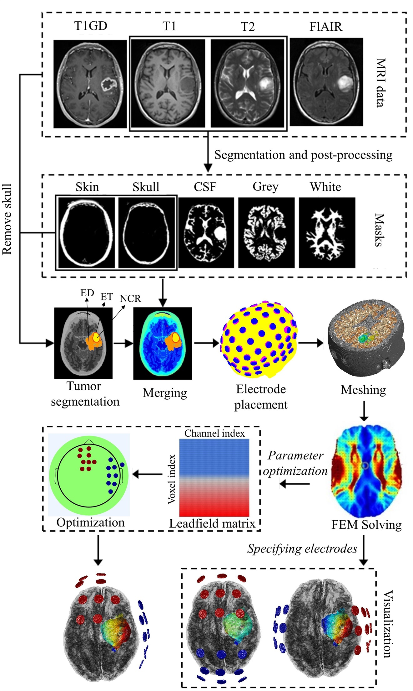

# AutoSimTTF

<p align="center">
  
</p>

**AutoSimTTF** is a fully automatic pipeline for personalized electric field simulation and treatment planning of Tumor Treating Fields (TTFields). It integrates deep learning-based tumor segmentation (3D UNet), finite element modeling (GetDP), and convex optimization (CVX) to deliver a complete workflow from patient MRI to optimized electrode montage.

> 📄 Xie et al., *"AutoSimTTF: a fully automatic pipeline for personalized electric field simulation and treatment planning of tumor treating fields,"* Phys. Med. Biol. 71 045004 (2026).

---

## Quick Start

```matlab
% 1. TTF simulation (finite element modeling + E-field computation)
ttfsim('example/UPENN-00604_T1.nii', {'T8', 80, 'FTT7h', 0}, ...
    'capType', '1020', 'T2', 'example/UPENN-00604_T2.nii', ...
    'simulationTag', 'sim001');

% 2. Generate lead field for targeting optimization
ttfsim('example/UPENN-00604_T1.nii', 'leadfield', ...
    'T2', 'example/UPENN-00604_T2.nii', 'simulationTag', 'lf001');

% 3. Optimize electrode montage for a target location
ttf_target('example/UPENN-00604_T1.nii', 'lf001', [-30, -20, 50]);

% 4. Review results
reviewRes('example/UPENN-00604_T1.nii', 'sim001');
```

---

## Input Data

Place the following 4 NIfTI files for each subject in the same folder:

| File           | Naming convention            |
|----------------|------------------------------|
| T1-weighted    | `<subject>_T1.nii.gz`       |
| T2-weighted    | `<subject>_T2.nii.gz`       |
| T1-Gd          | `<subject>_T1GD.nii.gz`     |
| FLAIR          | `<subject>_FLAIR.nii.gz`    |

The pipeline automatically segments normal brain tissues (via SPM12) and tumor sub-regions (via 3D UNet).

---

## Main Functions

### `ttfsim` — TTF Simulation

```matlab
ttfsim(subj, recipe, ...)
```

| Argument     | Description                                                            |
|-------------|------------------------------------------------------------------------|
| `subj`       | Path to T1 NIfTI file                                                  |
| `recipe`     | `{'ElecName', Current_mA, ...}` or `'leadfield'` for lead field mode  |
| `...`        | Optional parameter-value pairs (see below)                             |

**Key options:**

| Option            | Description                                  | Default        |
|-------------------|----------------------------------------------|----------------|
| `capType`         | EEG cap system                               | `'1010'`       |
| `elecType`        | Electrode shape                              | `'disc'`       |
| `elecSize`        | Electrode dimensions (mm)                    | depends on type|
| `T2`              | T2 MRI for improved segmentation             | `[]`           |
| `simulationTag`   | Unique label for this run                    | auto-generated |
| `conductivities`  | Tissue conductivity struct (S/m)             | literature vals|
| `frequency`       | Stimulation frequency (Hz)                   | `200000`       |

### `ttf_target` — Electrode Montage Optimization

```matlab
ttf_target(subj, simTag, targetCoord, ...)
```

| Argument       | Description                                           |
|---------------|-------------------------------------------------------|
| `subj`         | Path to T1 NIfTI file                                 |
| `simTag`       | Simulation tag from a prior `ttfsim(..., 'leadfield')` run |
| `targetCoord`  | Target coordinate(s) — `[x, y, z]` in MNI or voxel space |
| `...`          | Optional parameter-value pairs                        |

**Key options:** `coordType` (`'mni'`/`'voxel'`), `orient`, `elecNum`, `targetRadius`

### `reviewRes` — Result Visualization

```matlab
reviewRes(subj, simTag)
```

Displays 3D renderings and slice views of voltage and electric field distributions.

---

## Requirements

- **MATLAB** R2019b or later (with Image Processing Toolbox)
- **SPM12** — bundled in `lib/spm12/`
- **GetDP** — bundled in `lib/getdp/`
- **CVX** — convex optimization solver ([cvxr.com](http://cvxr.com))
- **Python** 3.8+ with PyTorch — for 3D UNet tumor segmentation
  - Packages: `numpy`, `nibabel`, `h5py`, `tqdm`

Configure Python environment in MATLAB before first run:

```matlab
pyenv('Version', 'C:\path\to\your\python.exe');
pyenv('ExecutionMode', 'OutOfProcess');
```

---

## Outputs

For each simulation tagged `<tag>`:

| File                                  | Content                              |
|---------------------------------------|--------------------------------------|
| `<subj>_<tag>_simResult.mat`          | Voltage & E-field (MATLAB)           |
| `<subj>_<tag>_emag.nii`               | E-field magnitude (NIfTI)            |
| `<subj>_<tag>_e.nii`                  | E-field vector (NIfTI)               |
| `<subj>_<tag>_v.nii`                  | Voltage map (NIfTI)                   |
| `<subj>_<tag>.mat`                    | Mesh data (nodes, elements, faces)    |
| `<subj>_<tag>_simOptions.mat`         | Simulation parameters                |
| `<subj>_simLog`                       | Human-readable log                    |

Segmentation outputs are saved as NIfTI tissue masks (`c1–c6*`) and tumor masks (`*_segm.nii`).

---

## License

This project is licensed under the **MIT License** — see [LICENSE](LICENSE.md).

Third-party libraries bundled under `lib/` retain their original licenses (GPLv2, BSD). See `LICENSE.md` for details.

---

## Acknowledgments

AutoSimTTF is built upon [ROAST](https://github.com/andypotatohy/roast) (Huang et al., 2017–2019), an open-source pipeline for transcranial electric stimulation modeling. We gratefully acknowledge the ROAST authors and the developers of SPM12, iso2mesh, GetDP, and FieldTrip/EEGLAB for their foundational tools.
